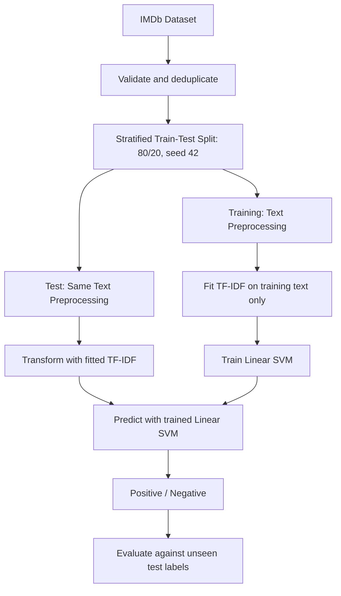

# 1. TITLE AND GROUP ROLL NUMBERS

**IMDb Movie Review Sentiment Analysis using SVM (Support Vector Machine) and TF-IDF (Term Frequency-Inverse Document Frequency)**

Student Name: [Student Name]  
Roll Number: [Roll Number]  
Group Members: [Names and Roll Numbers]

# 2. INTRODUCTION + WHY THE ALGORITHM WAS SELECTED

Sentiment analysis identifies opinions expressed in text. It is a task in NLP (Natural Language Processing). We classify IMDb movie reviews as positive or negative using supervised learning.

TF-IDF (Term Frequency-Inverse Document Frequency) converts reviews into numerical features. SVM (Support Vector Machine) learns a decision boundary separating the two classes. We selected Linear SVM because TF-IDF produces high-dimensional sparse features, for which a linear classifier is efficient and effective. Unigrams and bigrams retain individual words and short phrases; negations are preserved.

# 3. FLOWCHART / BLOCK DIAGRAM

TF-IDF means Term Frequency-Inverse Document Frequency; SVM means Support Vector Machine. The split deliberately precedes fitting TF-IDF. Fitting TF-IDF before splitting would leak test-set information. Application flow: movie review → shared preprocessing → saved TF-IDF → saved Linear SVM → positive/negative sentiment.

# 4. RESULTS

Dataset: 2,000 reviews; 1,000 positive and 1,000 negative. Training: 1,600; testing: 400. Removed: 0 rows.

| Metric | Held-out test result |
| --- | ---: |
| Accuracy | 88.25% |
| Precision | 85.58% |
| Recall | 92.00% |
| F1-score | 88.67% |

Precision, recall and F1 use **positive** as the positive class. Values are automatically generated from the real held-out test evaluation.

| Actual / Predicted | Negative | Positive |
| --- | ---: | ---: |
| Negative | 169 | 31 |
| Positive | 16 | 184 |

Correct predictions: 353 of 400. False positives: 31; false negatives: 16. Complete evidence: `results/metrics.json`, `results/test_predictions.csv`, and `results/classification_report.json`.

# 5. CONCLUSION

TF-IDF and Linear SVM achieved 88.25% accuracy and 88.67% positive-class F1 on this 400-review holdout. The saved pipeline supports interactive predictions without retraining. The experiment demonstrates a reproducible NLP workflow with consistent preprocessing and isolated test data.

Performance is specific to this sampled dataset. Sarcasm, mixed opinions and unfamiliar vocabulary remain limitations; there is no neutral class or calibrated confidence estimate. Future work could use more representative data and training-only cross-validation, followed by evaluation on a new untouched test set.
