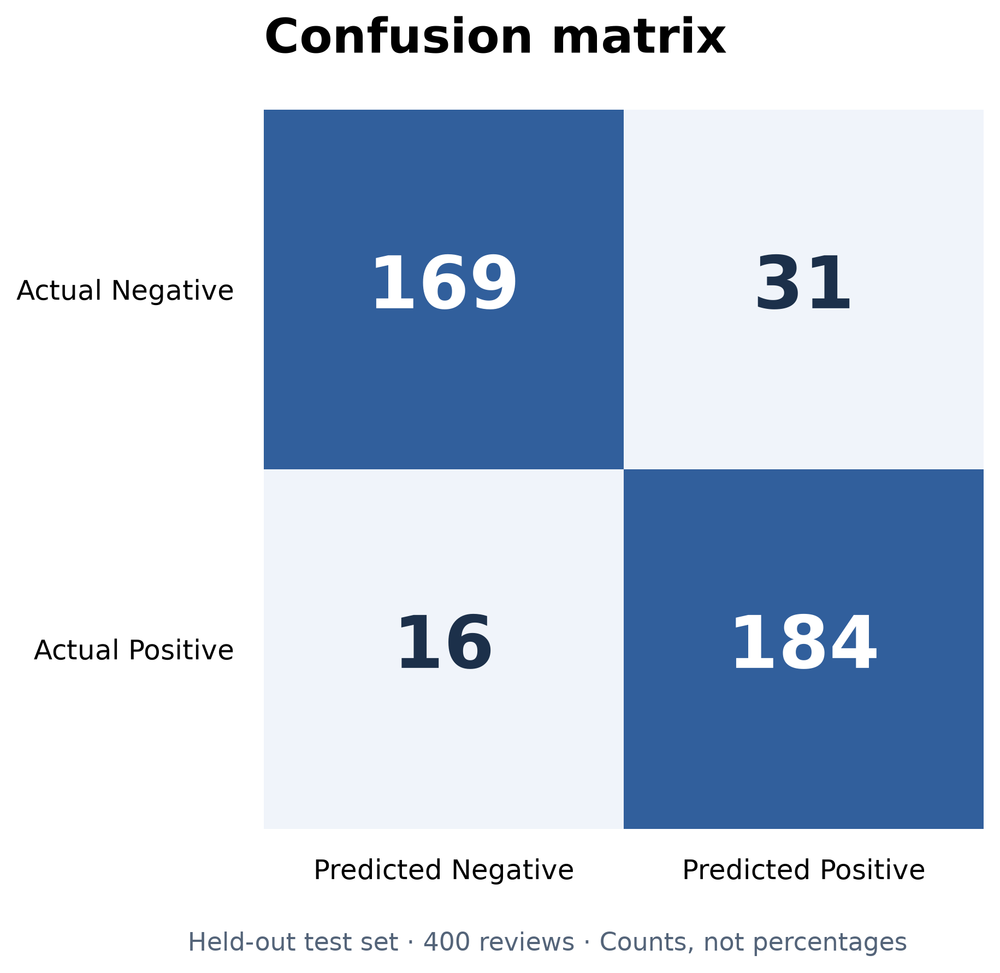
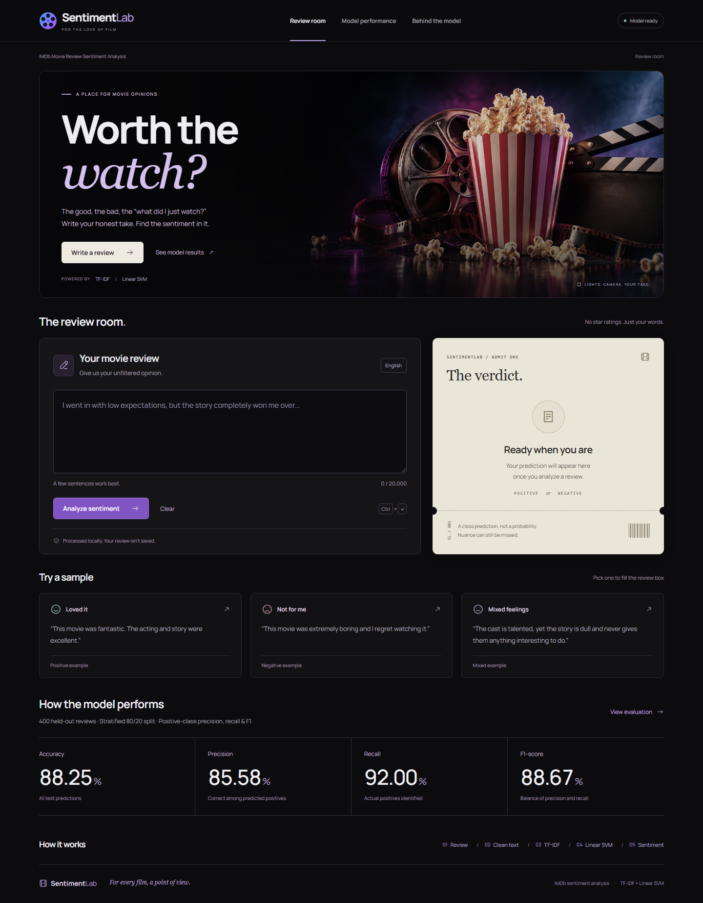
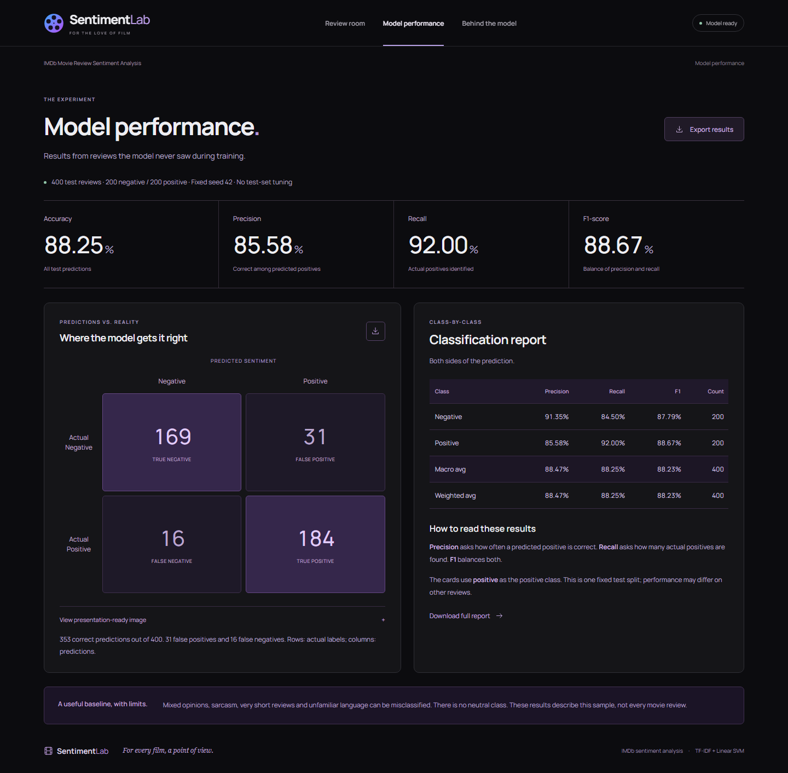

# IMDb Movie Review Sentiment Analysis

An academic application using SVM (Support Vector Machine) and TF-IDF (Term Frequency-Inverse Document Frequency). A custom, responsive HTML/CSS/JavaScript interface is served by a single FastAPI Python application. No Node build or external service is needed.

## Objective and problem statement

Predict whether an English movie review expresses positive or negative sentiment. Sentiment analysis is an NLP (Natural Language Processing) classification task: converting natural-language text into a machine-readable representation and learning its association with labeled sentiment. This project demonstrates a reproducible supervised learning workflow and an application that uses its saved model.

## Dataset and inspection

Source: user-provided `IMDB_Sampled_Balanced.csv`, copied unchanged from `D:/Downloads/IMDB_Sampled_Balanced.csv` into `data/`. The file is described by its supplier as sampled IMDb reviews; its original sampling procedure and movie/author identifiers are unavailable. Dataset dates are not supplied, so temporal representativeness cannot be assessed.

- Columns: `review` and `sentiment`; original shape: `(2000, 2)`.
- Inferred types: `{'review': 'object', 'sentiment': 'object'}`.
- Original records: **2,000**; records used: **2,000**.
- Positive: **1,000**; negative: **1,000**.
- Missing values: `{'review': 0, 'sentiment': 0}`; duplicate rows: **0**; duplicate review texts: **0**.
- Excluded rows: **0**. Exact row numbers and reasons, first five full rows, schema and SHA-256 are saved in `results/dataset_audit.json`.
- Same normalized review text cannot cross the train/test boundary. Conflicting labels are excluded together, and same-label normalized duplicates retain their first occurrence. No resampling is used.

## Methodology

1. Inspect columns by their content, validate labels, and audit invalid/duplicate texts.
2. Split raw review text **80/20**, with `random_state=42` and `stratify=y`: **1,600 training** ({'positive': 800, 'negative': 800}) and **400 testing** ({'negative': 200, 'positive': 200}). CSV source row membership is saved in `results/split_manifest.csv`.
3. Fit one scikit-learn `Pipeline` on training data only. Its TF-IDF vectorizer calls the reusable `sentiment.preprocessing.clean_text` function, so training and inference use exactly the same transformation.
4. Use TF-IDF with `ngram_range=(1, 2)`, `min_df=2`, `sublinear_tf=True`, L2 normalization, smooth IDF, and no stopword list or feature cap. There are **43,784 learned features**. A cap is unnecessary at this dataset size; minimum document frequency filters one-off terms. Bigrams can distinguish phrases such as “not good.”
5. Train `sklearn.svm.LinearSVC(C=1.0, random_state=42, dual=True, max_iter=10000)`. The dual solver is appropriate for this feature count relative to the number of samples. Convergence warnings fail training rather than being silently ignored.
6. Evaluate once on the held-out test partition. No hyperparameter search, test-based model selection, or final refit on test records is performed. The shipped artifact is the evaluated model.
7. Save the complete pipeline with joblib; reload it and confirm identical test predictions. Record predictions for six custom reviews not present in the dataset. These examples are smoke checks, not an additional accuracy estimate.

### Text preprocessing

Normalize Unicode and lowercase; decode HTML entities; remove HTML tags and URLs; normalize punctuation and whitespace. Expand negative contractions (for example, “isn't” → “is not”). Preserve `not`, `no`, and `never`; do not stem, lemmatize, or aggressively remove stopwords. Normalization is deterministic and does not learn from data.

### TF-IDF and why Linear SVM

TF-IDF weights a word or two-word phrase by its frequency in a review and its rarity across training documents. Sublinear term frequency uses `1 + log(tf)` for nonzero counts. Scikit-learn's smooth IDF is `log((1 + n) / (1 + df)) + 1`, followed by L2 normalization. Vocabulary and document frequencies are learned exclusively from training text.

A linear SVM learns a separating hyperplane in this sparse, high-dimensional feature space. Its regularization parameter `C` controls the tradeoff between fitting training labels and regularization. Linear SVM is effective and computationally practical for sparse text classification. This is a classical machine learning model, not a generative AI system. LinearSVC has no direct `predict_proba`; the interface shows the predicted class without fabricated confidence.

## Actual results

| Metric | Held-out test result |
| --- | ---: |
| Accuracy | 88.25% |
| Precision | 85.58% |
| Recall | 92.00% |
| F1-score | 88.67% |

All values above were computed from **400 unseen test reviews**. For binary precision, recall, and F1, the positive class is explicitly **positive**. Macro and weighted averages for both classes are in `results/classification_report.json`.

- Accuracy: `(TP + TN) / all test reviews`.
- Precision: `TP / (TP + FP)` — how often a predicted positive is correct.
- Recall: `TP / (TP + FN)` — how many actual positives are found.
- F1-score: harmonic mean of positive-class precision and recall.
- Confusion matrix: rows are actual labels, columns are predicted labels, ordered negative then positive.

| Actual / Predicted | Negative | Positive |
| --- | ---: | ---: |
| Negative | 169 | 31 |
| Positive | 16 | 184 |



The balanced majority baseline is 50% accuracy. Results describe this single sampled holdout, not all IMDb reviews. Sarcasm, mixed opinions, short text and out-of-domain or non-English input can fail. Keeping negations helps preserve information but does not guarantee correct interpretation. Exact normalized duplicates are checked; semantic near-duplicates and same-movie/author overlap cannot be ruled out from the supplied fields. Neutral sentiment is not a trained class.

### Custom reviews after reloading

| Custom review | Intended sentiment | Saved-model prediction |
| --- | --- | --- |
| This movie was fantastic. The acting and story were excellent. | positive | positive |
| This movie was extremely boring and I regret watching it. | negative | negative |
| I expected very little, but the characters won me over. A thoughtful and moving film. | positive | positive |
| The cast is talented, yet the story is dull and never gives them anything interesting to do. | negative | negative |
| Not a perfect film, but I enjoyed its warmth and wonderful performances. | positive | positive |
| Beautiful photography cannot rescue this tedious, empty story. | negative | positive |

5 of 6 examples matched their intended sentiment. These deliberately chosen examples are functional checks, not an unbiased performance estimate. The photography example illustrates a real failure on a negative review with mixed cues; no prediction has been manually corrected.

## Architecture and files

```text
Browser (static HTML/CSS/JS)
  -> POST /api/predict
  -> saved pipeline: normalization -> TF-IDF -> LinearSVC
  -> positive / negative

ML_MIN_PRO/
  app.py                         FastAPI server; loads artifacts once
  train.py                       Inspect, train, evaluate and generate docs
  sentiment/
    preprocessing.py             Shared text normalization
    dataset.py                   Validation and removal audit
    documentation.py             Results-backed documentation generator
  static/                        Responsive frontend, no build step
  data/IMDB_Sampled_Balanced.csv  Unchanged source copy
  artifacts/sentiment_pipeline.joblib
  results/                       Metrics, audit, split, predictions, chart, logs
  tests/                         Model, methodology, API and browser checks
  requirements.txt               Runtime/training dependencies
  requirements-dev.txt           Test dependencies
  requirements-lock.txt          Exact verified environment
  PRESENTATION.md                Five required presentation sections
```

## Setup and run (PowerShell, Python 3.12)

The environment and artifacts are already created in this workspace. To run:

```powershell
cd D:\ML_MIN_PRO
.\.venv\Scripts\python.exe -m uvicorn app:app --host 127.0.0.1 --port 8000
```

Open **http://127.0.0.1:8000**. API documentation: `/docs`. Stop with Ctrl+C. Starting the server does not retrain. Stop and restart after replacing training artifacts. The working directory may differ when using `--app-dir D:\ML_MIN_PRO`; data and artifact paths are resolved from source files.

To recreate the verified environment on another Windows machine:

```powershell
python -m venv .venv
.\.venv\Scripts\python.exe -m pip install -r requirements-lock.txt
```

The lock includes verification tools. `requirements.txt` is the smaller runtime/training set with compatible version ranges; use the lock for exact reproducibility with the saved artifact. Python and library versions are also recorded in `results/metrics.json`.

To explicitly retrain and regenerate all evaluation outputs and this documentation:

```powershell
.\.venv\Scripts\python.exe train.py
```

Alternate CSV: add `--data path/to/file.csv`; it must have one positive/negative column and one review-text column. Existing generated artifacts are replaced on a successful run. Original CSV data is never changed. If new training fails, rerun successfully before starting the app; the app checks model/result identity.

## Application features

- A black cinema interface with restrained purple/blue accents, local Manrope typography, editorial serif accents, and horizontal navigation.
- A cinema hero with a Write a review shortcut, review editor, ivory admit-one prediction ticket, and clickable positive, negative and mixed review excerpts. Character count, clear action and Ctrl+Enter submission are supported.
- Accessible result and error messages; handles blank input, excessive length, text without learned vocabulary and server errors.
- Evaluation view with a flat row of actual metrics, a dark confusion matrix populated from saved results, expandable presentation PNG, full per-class scores and downloadable JSON/PNG results.
- Dataset audit and methodology view with class counts, train/test counts, parameters and preprocessing explanation.
- Responsive desktop/mobile layout, visible keyboard focus, subtle hero and hover animations, and ticket-stamp prediction feedback. Animations respect prefers-reduced-motion; results are automatically brought into view after mobile predictions.
- Artwork and fonts are local, so no third-party asset requests occur at runtime. See [asset prompts and font license](static/assets/ARTWORK.md).
- Reviews are sent only to the local server and are not stored by the application.




## Validation

```powershell
.\.venv\Scripts\python.exe -m pytest -q
.\.venv\Scripts\python.exe -m playwright install chromium
# Keep the app running for the browser check:
.\.venv\Scripts\python.exe tests/browser_check.py
```

Tests independently recompute the confusion matrix and binary metrics from saved predictions, rebuild the vocabulary and IDF from only the training rows, verify split disjointness and reload identity, and exercise API validation. Browser checks cover predictions, navigation, downloads, failure recovery and mobile overflow, saving screenshots to `results/`. Results of executed checks are recorded in `results/validation.json`.

## References

- [scikit-learn LinearSVC](https://scikit-learn.org/stable/modules/generated/sklearn.svm.LinearSVC.html)
- [scikit-learn TfidfVectorizer](https://scikit-learn.org/stable/modules/generated/sklearn.feature_extraction.text.TfidfVectorizer.html)
- [scikit-learn data leakage guidance](https://scikit-learn.org/stable/common_pitfalls.html#data-leakage)
